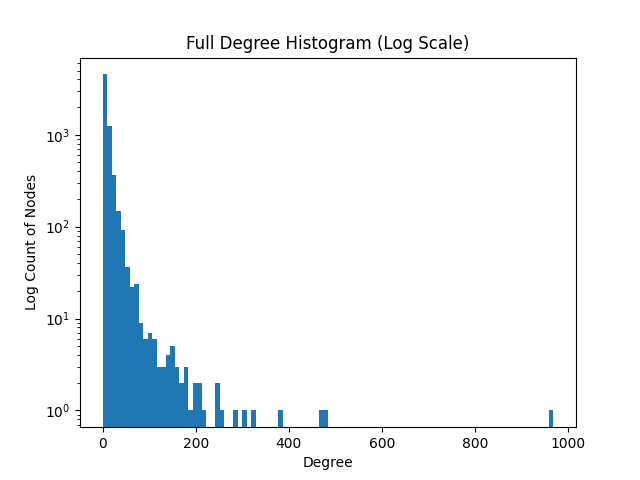

# CS 768 Assignment - 
## Group - 
Ekansh Ravi Shankar (22B1032)  
Geet Singhi (22B1035)  
Ved Danait (22B1818)  
Tanmay Gejapati (22B0969)

## Task 1 - 

1. Title Extraction
    Each folder's title is loaded from title.txt.

    Latex markup is stripped using regular expressions to get a clean lowercase title.

2. Citation Extraction
    From .bib: Uses bibtexparser to parse BibTeX entries and extract the title field from each cited entry.

    From .bbl: Uses regex to extract the title = {...} or title = "..." entries.

    Latex cleaning is applied to all extracted citation titles.

3. Parallel Processing
    Title and citation extraction across all folders is parallelized using ProcessPoolExecutor, significantly speeding up processing on large datasets.

4. Title Matching with Fuzzy Search
    For each citing paper:

    All extracted citation titles are matched against known titles using rapidfuzz with token_sort_ratio.

    Matches with similarity ≥ 80 are accepted.

    Avoids self-citations.

5. Graph Construction
    Nodes: One per paper folder.

    Edges: Directed from citing paper to cited paper based on fuzzy title matches.

    Stored as a networkx.DiGraph.

6. Saving Output
    The graph and its mappings (folder_to_id, id_to_folder) are serialized to new_build_parallel/:

    citation_graph.gpickle

    citation_graph_folder_to_id.json

    citation_graph_id_to_folder.json

    citation_graph_id_to_text.json

### Graph Properties - 
Number of edges = 32874  
Number of isolated nodes = 1023  
Average in-degree = 5.02  
Average out-degree = 5.02  
Diameter = 11

Histogram of degree of nodes (in log scale) -  

## Task 2 - 

Model - Uses allenai/specter, a SentenceTransformer model trained specifically for scientific papers. Embeddings are computed using:

embedding = SPECTER(title + abstract)  

### Cosine Similarity Computation  
Encodes the query title+abstract.  
Computes cosine similarity with every node in the graph.  
Sorts and prints top matches by similarity.

### Other Approaches tried 
- See all-tries branch for all this
- Feature engineering on the graph model dataset (did not work since the new node has only title and abstract and this cannot be reduced to a link prediction mode) and time taken to train was too long
- Transformer trained on the text to convert it into embeddings and used to solve a 0-1 link prediction model with Cross Entropy Loss (did not work because model was too big ~420 MB and takes way too long for training and inference)